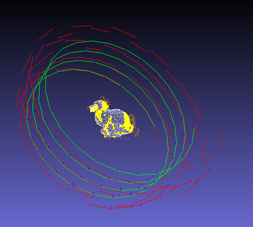
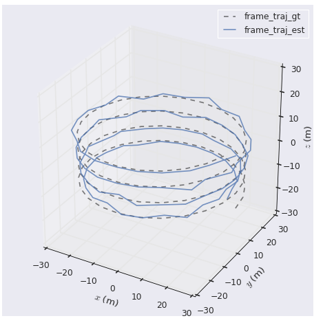
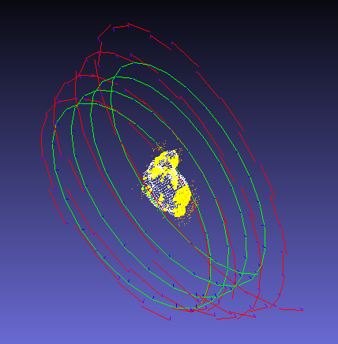
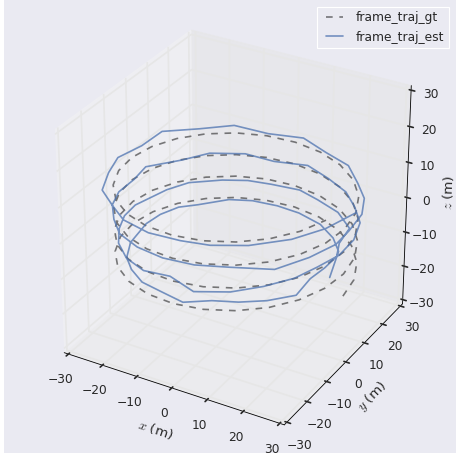
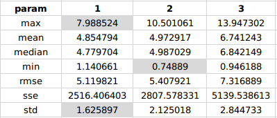
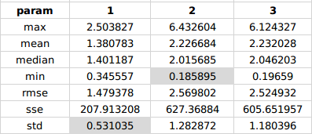
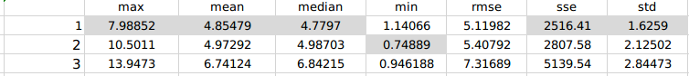

## 1. Task 1 : 直接三角化
   
 ```
 evo_traj tum frame_traj_est.txt --ref=frame_traj_gt.txt -p --plot_mode xyz  --align --correct_scale
 ```


```
evo_ape tum frame_traj_est.txt frame_traj_gt.txt  -va --plot --plot_mode xyz --save_results ape.zip
       max	7.988524
      mean	4.854794
    median	4.779704
       min	1.140661
      rmse	5.119821
       sse	2516.406403
       std	1.625897
```
```

 evo_rpe tum frame_traj_est.txt frame_traj_gt.txt  -va --plot --plot_mode xyz --save_results rpe.zip

       max	2.503827
      mean	1.380783
    median	1.401187
       min	0.345557
      rmse	1.479378
       sse	207.913208
       std	0.531035
```
```
evo_res ape.zip -p --save_table table.csv

                   max     mean  median      min     rmse      sse     std
frame_traj_gt  7.98852  4.85479  4.7797  1.14066  5.11982  2516.41  1.6259
```


## 2. task2： 三角化 + BA



 ```
 evo_traj tum frame_traj_est.txt --ref=frame_traj_gt.txt -p --plot_mode xyz  --align --correct_scale
 ```


```
evo_ape tum frame_traj_est.txt frame_traj_gt.txt  -va --plot --plot_mode xyz --save_results ape.zip
       max	10.501061
      mean	4.972917
    median	4.987029
       min	0.748890
      rmse	5.407921
       sse	2807.578331
       std	2.125018
```
```

 evo_rpe tum frame_traj_est.txt frame_traj_gt.txt  -va --plot --plot_mode xyz --save_results rpe.zip
       max	6.432604
      mean	2.226684
    median	2.015685
       min	0.185895
      rmse	2.569802
       sse	627.368840
       std	1.282872
```
```
evo_res ape.zip -p --save_table table.csv

                   max     mean   median      min     rmse      sse      std
frame_traj_gt  10.5011  4.97292  4.98703  0.74889  5.40792  2807.58  2.12502
```


## 3. task3: 三角化 + BA + outlier



 ```
 evo_traj tum frame_traj_est.txt --ref=frame_traj_gt.txt -p --plot_mode xyz  --align --correct_scale
 ```
 

```
evo_ape tum frame_traj_est.txt frame_traj_gt.txt  -va --plot --plot_mode xyz --save_results ape.zip
       max	13.947302
      mean	6.741243
    median	6.842149
       min	0.946188
      rmse	7.316889
       sse	5139.538613
       std	2.844733
```
```

 evo_rpe tum frame_traj_est.txt frame_traj_gt.txt  -va --plot --plot_mode xyz --save_results rpe.zip
       max	6.124327
      mean	2.232028
    median	2.046203
       min	0.196590
      rmse	2.524932
       sse	605.651957
       std	1.180396
```
```
evo_res ape.zip -p --save_table table.csv
                   max     mean   median       min     rmse      sse      std
frame_traj_gt  13.9473  6.74124  6.84215  0.946188  7.31689  5139.54  2.84473
```


## 4 综合分析

evo_ape(计算绝对位姿误差）


**evo_rpe(计算相对位姿误差)**

 

**evo_res(结果比较) 




总体效果，出现ba与outlier的操作结果反而使效果偏差，具体问题不详，待进一步检查。