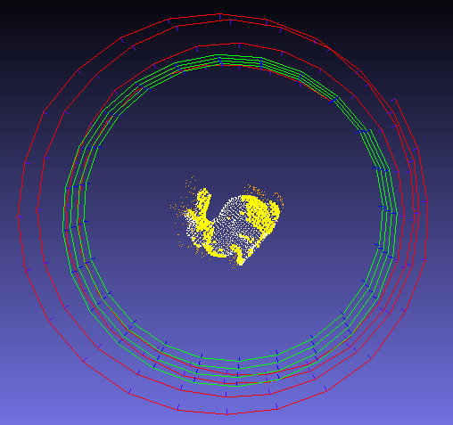

## 1. Task 1 : 直接三角化
   
 ```
 evo_traj tum frame_traj_est.txt --ref=frame_traj_gt.txt -p --plot_mode xyz  --align --correct_scale
 ```


```
evo_ape tum frame_traj_est.txt frame_traj_gt.txt  -va --plot --plot_mode xyz --save_results ape.zip
       max	7.988524
      mean	4.854794
    median	4.779704
       min	1.140661
      rmse	5.119821
       sse	2516.406403
       std	1.625897
```
```

 evo_rpe tum frame_traj_est.txt frame_traj_gt.txt  -va --plot --plot_mode xyz --save_results rpe.zip

       max	2.503827
      mean	1.380783
    median	1.401187
       min	0.345557
      rmse	1.479378
       sse	207.913208
       std	0.531035
```
```
evo_res ape.zip -p --save_table table.csv

                   max     mean  median      min     rmse      sse     std
frame_traj_gt  7.98852  4.85479  4.7797  1.14066  5.11982  2516.41  1.6259
```


## 2. task2： 三角化 + BA


 ```
 evo_traj tum frame_traj_est.txt --ref=frame_traj_gt.txt -p --plot_mode xyz  --align --correct_scale
 ```


```
evo_ape tum frame_traj_est.txt frame_traj_gt.txt  -va --plot --plot_mode xyz --save_results ape.zip
       max	2.830356
      mean	1.088119
    median	1.117042
       min	0.046486
      rmse	1.222984
       sse	143.586343
       std	0.558291
```
```

 evo_rpe tum frame_traj_est.txt frame_traj_gt.txt  -va --plot --plot_mode xyz --save_results rpe.zip
       max	1.798316
      mean	0.498460
    median	0.380933
       min	0.027438
      rmse	0.624018
       sse	36.992823
       std	0.375414
```
```
evo_res ape.zip -p --save_table table.csv
                   max     mean   median        min     rmse      sse      std 
frame_traj_gt  2.83036  1.08812  1.11704  0.0464858  1.22298  143.586  0.558291   
```


## 3. task3: 三角化 + BA + outlier


 ```
 evo_traj tum frame_traj_est.txt --ref=frame_traj_gt.txt -p --plot_mode xyz  --align --correct_scale
 ```
 

```
evo_ape tum frame_traj_est.txt frame_traj_gt.txt  -va --plot --plot_mode xyz --save_results ape.zip
       max	6.969077
      mean	2.746384
    median	2.443365
       min	0.281874
      rmse	3.175060
       sse	967.776786
       std	1.593231
```
```

 evo_rpe tum frame_traj_est.txt frame_traj_gt.txt  -va --plot --plot_mode xyz --save_results rpe.zip
       max	2.184738
      mean	0.556210
    median	0.509827
       min	0.029194
      rmse	0.698139
       sse	46.302846
       std	0.421934
```
```
evo_res ape.zip -p --save_table table.csv
                   max     mean   median       min     rmse      sse      std
frame_traj_gt  6.96908  2.74638  2.44336  0.281874  3.17506  967.777  1.59323

```


## 4 综合分析

evo_ape(计算绝对位姿误差）

|        | 1           | 2          | 3          |
| ------ | ----------- | ---------- | ---------- |
| max    | 7.988524    | 2.830356   | 6.969077   |
| mean   | 4.854794    | 1.088119   | 2.746384   |
| median | 4.779704    | 1.117042   | 2.443365   |
| min    | 1.140661    | 0.046486   | 0.281874   |
| rmse   | 5.119821    | 1.222984   | 3.17506    |
| sse    | 2516.406403 | 143.586343 | 967.776786 |
| std    | 1.625897    | 0.558291   | 1.593231   |

**evo_rpe(计算相对位姿误差)**

| max    | 2.503827   | 1.798316  | 2.184738  |
| ------ | ---------- | --------- | --------- |
| mean   | 1.380783   | 0.49846   | 0.55621   |
| median | 1.401187   | 0.380933  | 0.509827  |
| min    | 0.345557   | 0.027438  | 0.029194  |
| rmse   | 1.479378   | 0.624018  | 0.698139  |
| sse    | 207.913208 | 36.992823 | 46.302846 |
| std    | 0.531035   | 0.375414  | 0.421934  |

 

**evo_res(结果比较) 

​						     max      mean   median       min         rmse      sse      std
frame_traj_gt  7.98852  4.85479  4.7797    1.14066      5.11982  2516.41  1.6259
frame_traj_gt  **2.83036**  **1.08812**  **1.11704**  **0.0464858**  **1.22298**  143.586  **0.558291**  
frame_traj_gt  6.96908  2.74638  2.44336  0.281874    3.17506  967.777  1.59323


** 时间消耗

| -             | 1         | 2          | 3          |
| ------------- | --------- | ---------- | ---------- |
| 时间(clock()) | 3,539,027 | 25,676,731 | 20,456,998 |


总体效果，任务一计算的vo有较大的累积偏差，任务二加入ba的优化的效果比较好，能有效减少偏差，但相应的计算耗时接近10倍增加，任务三加入outlier的方式， vo优化效果相比任务二效果变差了一点，整体上强于任务一，因为outlier判断减少了计算点数，耗时比任务二少。


注意事项：

 eigen对数据类型敏感，double与float需要显示转换；
 ba优化中的相机节点的pose需要是Tcw; 
 两帧BA优化中需要将第一帧fixed; 
注意eigen与cv::mat间的转换， 坐标系的转换